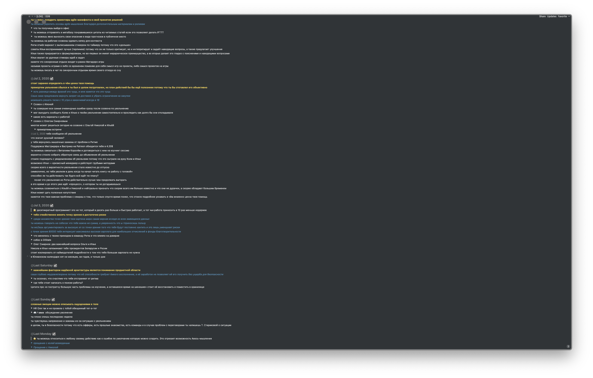
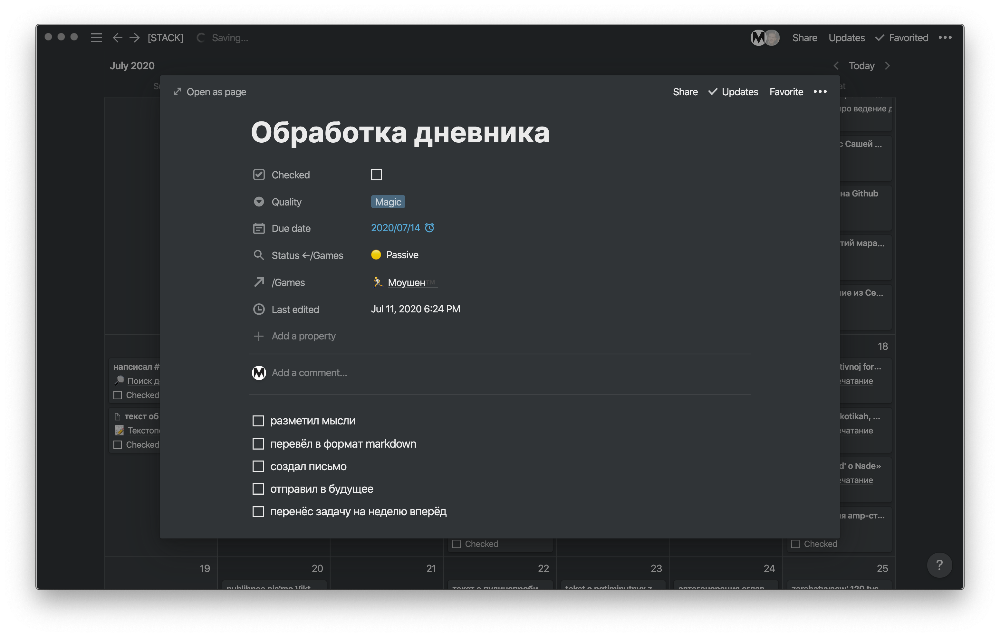
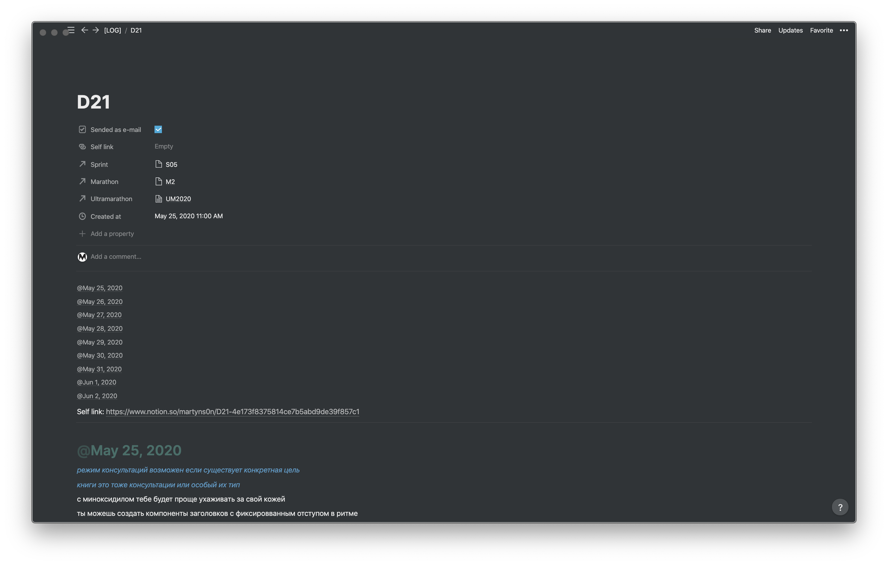
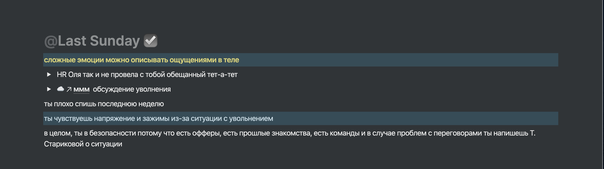

---
presentation:
  theme: white.css
  margin: 0.1
  minScale: 0.2
  maxScale: 1.5
  controls: true
  progress: true
  slideNumber: true
  keyboard: true
  overview: true
  center: false
  touch: true
  shuffle: false
  enableSpeakerNotes: true
  fragments: true
  hideAddressBar: true
  transition: 'slide'
  transitionSpeed: 'default'
  backgroundTransition: 'default'
---

<!-- slide class="milestone" data-notes="" -->

# Ведение дневника
*для тех, кто оставил это тринадцатилетним девочкам*

<!-- slide class="milestone" data-notes="5 min"-->
## Мета

<!-- slide id="hi" data-notes="Меня зовут Мартын и вы можете меня знать по таким докладам как..."-->
### Привет

<!-- slide data-notes="Дело в том, что у осталось такое предубеждение с детства. Однажды я в поисках листа бумаги открыл записную книжку и обнаружил в ней личные записи дочери лучшей подруги моей мамы. Я её закрыл сразу, почти. С тех пор, мнение не обновлялось вплоть до ведения собственного дневника" -->
### Причём тут девочки

<!-- slide -->
### Как девочки пишут в дневник

- Под секретом <!-- .element: class="fragment" data-fragment-index="4" -->
- Развлекаются  <!-- .element: class="fragment" data-fragment-index="2" -->
- Выражают эмоции <!-- .element: class="fragment" data-fragment-index="1" -->
- Наивно и «процесс ради процесса»  <!-- .element: class="fragment" data-fragment-index="3" -->

<!-- slide -->
### Мой путь к осознанности

- Идеи  <!-- .element: class="fragment" data-fragment-index="1" -->
- События  <!-- .element: class="fragment" data-fragment-index="5" -->
- Планы и задачи  <!-- .element: class="fragment" data-fragment-index="3" -->
- Проговаривание  <!-- .element: class="fragment" data-fragment-index="4" -->
- Прозрачность <!-- .element: class="fragment" data-fragment-index="6" -->

<!-- slide data-notes="Выписывание мыслей и событий с привязкой к дате (в хронологическом порядке). Каждый из вас уже ведёт дневник так как в интернете полно сервисов связывающих вашу активность с датами."-->
### Что такое дневник

> Дневник — это записи о мыслях и событиях, которые привязаны к дате и ведутся в хронологическом порядке.

<!-- slide data-notes="Для сравнения: Война и Мир весит 6 мегабайт"-->
### Чем похвастаюсь

- 2 года  <!-- .element: class="fragment" data-fragment-index="1" -->
- 1 мегабайт текста  <!-- .element: class="fragment" data-fragment-index="2" -->
  
<!-- slide vertical=true data-notes="как именно пишешь; за сколько дней; чуть пояснений; побольше описания" data-background-image="../assets/diary-talk/full-diary-example.png" -->

<!--  -->

<!-- slide class="milestone" data-notes="12 min. Далее я расскажу про достоинства ведения дневника и возражения. Их получилось по 5 штук"-->
## Достоинства и возражения

<!-- slide -->
### Достоинства дневника

<!-- slide -->
#### 🏗 Дневник как структура

- можно искать, тегировать и категоризировать <!-- .element: class="fragment" data-fragment-index="1" -->
- можно копировать и пересылать <!-- .element: class="fragment" data-fragment-index="4" -->
- можно переиспользовать <!-- .element: class="fragment" data-fragment-index="2" -->
- можно оформлять <!-- .element: class="fragment" data-fragment-index="3" -->
- можно редактировать <!-- .element: class="fragment" data-fragment-index="5" -->

<!-- slide  class="emoji" data-notes="ℹ️ Можно без углубления и объяснений медитации; Дневник утешает «голоса»; Выслушивание лучше чем глушение; Некоторые мысли делают больно если их не высказать;"-->
#### Дневник как медитация

🧘‍♀️🧘‍♂️ 

<!-- slide  class="emoji" data-notes="Дневник помогает понять своё состояние — Примеры с прочтением дневников из прошлого; Дневник помогает формулировать мысли"-->
#### Дневник как психотерапевт

👨‍⚕️ 

<!-- slide  class="emoji" data-notes="Дневник — инструмент, который укрепляет память: описывая опыт, делаешь нейронные связи сильнее, разбирая ошибки — осознаешь и стараешься их не совершать. 🛑 Дневник лучше чем память: мозг неявно меняется и меняет память, а дневник — нет. 🛑 Я бы хотел привести пример как исказил какое-то событие, а в дневнике описано было точнее, но на практике я хорошо помню именно благодаря тому что записываю. 🛑 Вероника Нуркова и Элизабет Лофтус"-->
#### Дневник как память

🧠 

<!-- slide  class="emoji" data-notes="Пример с интуитивными догадками в дневнике, которые оказались верными 🛑 Примеры про отправку дневника в будущее себе и Саше 🛑 - стоит больше про практический опыт 🛑 пользовательский путь; что значит получить письмо от себя из прошлого; опиши эмоции" -->
#### Дневник для доверия к себе

🎗 

<!-- slide -->
### Возражения
 
<!-- slide  class="emoji" data-notes="Вы можете начать с малого и без готовой системы. Я дорабатывал свой дневник, привычки и требования постепенно. С самого начала это приносило мне удовольствие и пользу. У меня есть еженедельная задача на обработку дневника и есть привычка писать в него по несколько раз в день."-->
#### На дневник надо много сил

🔋

<!-- slide vertical=true data-background-image="../assets/diary-talk/diary-task-example.png" -->
<!--  -->

<!-- slide  class="emoji" data-notes="Написание и чтение дневника не обязанность, а развлечение. Избегания могу появиться если: дневник пишется одним большим куском, неупорядочен, смешан с задачами и обязательствами, уходит много времени каждый раз, не напоминает о себе, скрыт от глаз. Я пишу в Notion, но это не единственный инструмент. Попробуйте поиграться с этим и начините с малого: один раз утром, в обед или перед сном"-->
#### Дневник некогда вести и читать

⏱ 

<!-- slide vertical=true data-background-image="../assets/diary-talk/example-of-dairy.png" -->
<!--  -->

<!-- slide  class="emoji" data-notes="Такое встречается, хотя сам не сталкивался. Это может быть связано с прошлыми заблуждениями, ложными решениями и травмирующими событиями. Если читать дневник больно, то это сигнал, что стоит обратиться за помощью или проработать это в дневнике." -->
#### Дневник больно перечитывать

🤕 

<!-- slide vertical=true data-background-size="contain" data-background-image="../assets/diary-talk/day-dairy-example.png"-->
<!--  -->

<!-- slide  class="emoji" data-notes="Возможно вы поставили завышенную планку и затраты не стоили результата. Вы можете вести дневник так как вам нравится, а не как «надо». Ещё возможен «провал с отказом». это когда я привязываюсь ко времени и частоте, но не укладываюсь и перестаю следовать плану совсем." -->
#### Я писал в дневник, но забросил

🗑 

<!-- slide class="emoji" data-notes="Пожалуйста, делитесь со мной своим опытом и открытиями в ведении дневника"-->
#### Я тоже веду дневник, поводы иные

🤝

<!-- slide class="emoji" data-notes="это предупреждение и сексизм. Ни девочки, ни женщины, ни я, ни даже Аллах не ответственны за то, что вы совмеваетесь в ведении дневника" -->
#### Дневник для девочек

🃏

<!-- slide class="milestone" -->
## Заключение

<!-- slide data-notes="ℹ️ стоит покороче без ухода в другой контекст"-->
### Писать или печатать

- QWERTY с нами уже более века 💀 <!-- .element: class="fragment" data-fragment-index="2" -->
- Большинство из нас с детства много пишут <!-- .element: class="fragment" data-fragment-index="1" -->
- Комфорт от печати можно повысить <!-- .element: class="fragment" data-fragment-index="3" -->
- Но даже без печати дневник полезен <!-- .element: class="fragment" data-fragment-index="4" -->

<!-- slide data-notes="ℹ️ Стоит напомнить о соцсетях и плавно перейти к инсте 🛑Доверие влияет на свободу описания личных переживаний. 🛑 По-умолчнаию стоит вести закрытый дневник. А по истечению времени можно делиться им с близкими или даже публиковать для всех желающих. 🛑 Для внешнего наблюдателя хочется быть лучшей версией себя, что может проявлятся в искажениям в социальных сетях. Тяжело доверять всем вокруг ведь кто угодно может начать пользоваться вашей наивностью." -->
### Публично или закрыто

<!-- slide data-notes="Пишите его так словно тринадцатилетняя девочка. А если бы я начал вести дневник с 13 лет, то мог бы лучше знать какие ошибки и успехи я совершал, а также лучше бы понимал прошлого себя с детства" -->
### Как писать дневник

- Эмоциоланьно
- Развлекайтесь
- Наивно и без цели
- Для себя

<!-- slide data-notes="Я Мартын. Занимаюсь не только тем, что пишу в днивник. Я Фронтендер и Скрам-мастер. В работе дневник мне помогает быстрее принимать решения и учиться на ошибках. Сейчас нахожусь в поиске команд и проектов." -->
### Кто я

