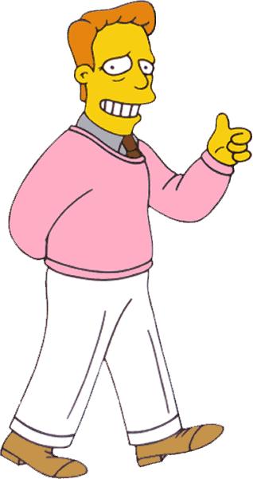

---
presentation:
  theme: white.css
  margin: 0.1
  minScale: 0.2
  maxScale: 1.5
  controls: true
  progress: true
  slideNumber: true
  keyboard: true
  overview: true
  center: false
  touch: true
  shuffle: false
  enableSpeakerNotes: true
  fragments: true
  hideAddressBar: true
  transition: 'slide'
  transitionSpeed: 'default'
  backgroundTransition: 'default'
---

@import "styles.less"

<!-- slide class="milestone" data-notes="" -->

# 📝 Talk title

<!-- slide class="milestone" data-notes="..."-->
## Meta

<!-- slide id="hi" data-notes="Hello, my name is John Doe..."-->

<!-- slide data-notes="..." -->

### WTF
